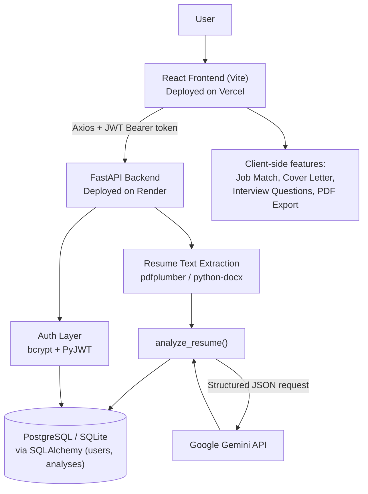

# AI Resume Analyzer

A full-stack web app where users upload a resume, get an instant ATS-style score with skill and improvement feedback, check how well it matches a job description, and export a cover letter, interview questions, and a PDF report — all behind a secure, multi-user login.

**Live frontend:** [ai-resume-analyzer-sailu1.vercel.app](https://ai-resume-analyzer-sailu1.vercel.app/) (current production deployment)

**Live backend:** [ai-resume-analyzer-b219.onrender.com](https://ai-resume-analyzer-b219.onrender.com) (Render — see [Production Deployment](#production-deployment) for current status)


## Overview

Tailoring a resume for every application and guessing whether it will survive an ATS filter is tedious. This project gives users a single place to do that: sign up, drop in a resume (PDF or DOCX), and immediately see an ATS score, extracted skills, strengths, and suggested improvements on a dashboard. From there, users can paste a job description to see a keyword-based match score, generate a draft cover letter and a set of interview questions from the analysis, download everything as a PDF report, and revisit past uploads from a history page.

The backend is a FastAPI service with real signup/login (hashed passwords + JWT sessions), real resume text extraction from PDF/DOCX files, and a live call to Google's Gemini API for the actual analysis — see [Notes on the Analysis Engine](#notes-on-the-analysis-engine) below for exactly what's AI-generated versus client-side logic.

## Features

- **Account system** — signup/login with bcrypt-hashed passwords and JWT-based sessions; dashboard, history, and profile routes are all auth-protected
- **Resume upload** — drag-and-drop or file picker, accepts PDF and DOCX
- **Resume text extraction** — real parsing via `pdfplumber` (PDF) and `python-docx` (DOCX)
- **AI-powered resume analysis** — the extracted resume text is sent to Google Gemini (`backend/app/ai.py`), which returns a structured, resume-specific ATS score, skills list, strengths, and improvement suggestions
- **Resume analysis dashboard** — ATS score shown as a color-coded radial gauge, extracted skills as a pie chart, plus strengths and improvement suggestions (Chart.js)
- **Job description matching** — paste a job description and get a match percentage, matching/missing skills, and suggested keywords (computed client-side against the extracted skill list)
- **Cover letter generator** — produces a formatted draft cover letter from the resume analysis, copyable and downloadable as a PDF
- **Interview question generator** — generates technical and behavioral questions based on the analysis, with adjustable difficulty and count
- **PDF report export** — downloads the full analysis (score, skills, strengths, suggestions, job match) as a single PDF via jsPDF
- **Analysis history** — per-user list of past uploads with the option to delete an entry

## Notes on the Analysis Engine

`backend/app/ai.py` sends the extracted resume text to the Gemini API (`google-genai` SDK, model set via the `MODEL_NAME` constant at the top of that file) with a structured JSON response schema, and returns a genuine, resume-specific `ats_score`, `skills`, `strengths`, `improvements`, and `summary` — it is not a fixed/canned response. This requires a valid `GEMINI_API_KEY` to be set on the backend; if the key is missing or the Gemini API call fails, `/upload` returns a `503` with a readable error instead of a fake result. The job-match, cover letter, and interview-question features are genuine, working features, but they run entirely client-side as rule-based/template logic, not LLM calls.

## Screenshots

| | |
|---|---|
| **Login**  | **Sign Up**  |
| **Resume Upload**  | **Job Description Match**  |
| **History**  | **Mobile View**  |

Full analysis dashboard (ATS score, skills, strengths, suggestions, summary): [docs/screenshots/analysis-results.png](docs/screenshots/analysis-results.png)

> Screenshots were captured from a local run of this exact codebase using a fictional sample resume — no real personal data is shown.

## Tech Stack

| Layer | Technology |
|---|---|
| Frontend | React 19, Vite, React Router v7 |
| HTTP Client | Axios |
| Charts | Chart.js (via react-chartjs-2) |
| PDF Export | jsPDF |
| Backend | FastAPI (Python) |
| Authentication | JWT (PyJWT) + bcrypt password hashing |
| Resume Parsing | pdfplumber (PDF), python-docx (DOCX) |
| AI | Google Gemini (`google-genai`) — powers live resume analysis |
| Data Storage | SQLAlchemy ORM — PostgreSQL in production, local SQLite file (`resume_analyzer.db`) when `DATABASE_URL` is unset |
| Deployment | Vercel (frontend), Render (backend) |
| Linting | Oxlint |

## System Architecture



## Project Structure

```
AI-Resume-Analyzer/
├── backend/
│   ├── app/
│   │   ├── main.py        # FastAPI app, routes, auth, CORS
│   │   ├── ai.py           # Resume analysis via the Gemini API
│   │   ├── parser.py       # PDF/DOCX text extraction
│   │   ├── database.py     # SQLAlchemy engine/session (PostgreSQL or SQLite)
│   │   └── models.py       # User/Analysis SQLAlchemy models + query helpers
│   ├── tests/              # Pytest suite (auth, analysis, persistence)
│   ├── uploads/            # Uploaded resumes at runtime (gitignored)
│   └── requirements.txt
├── frontend/
│   ├── src/
│   │   ├── App.jsx                  # Routes, upload flow, dashboard
│   │   ├── pages/                   # Login, Signup, Dashboard, History
│   │   ├── components/              # JobDescription, MatchResults,
│   │   │                            # CoverLetter, InterviewQuestions
│   │   ├── components/charts/       # ATSChart, SkillsChart (Chart.js)
│   │   └── utils/pdfGenerator.js    # Client-side PDF report export
│   └── package.json
└── docs/screenshots/       # README screenshots
```

## How It Works

1. A new user signs up (or logs in) — the backend hashes the password with bcrypt and issues a JWT on success.
2. From the dashboard, the user drags in or selects a resume (PDF/DOCX) and clicks **Analyze Resume**.
3. The file is sent to `POST /upload` with the JWT as a Bearer token; the backend saves it, extracts its text, and runs it through the analysis engine.
4. The dashboard renders the ATS score, skills, strengths, and suggestions, with chart visualizations.
5. The user can optionally paste a job description to get a client-side match score against the extracted skills, generate a cover letter or interview questions from the analysis, and download a full PDF report.
6. Every analysis is saved to the user's history, viewable (and deletable) on the History page.

## API

Base URL (production): the backend is deployed on Render (see [Production Deployment](#production-deployment)).

| Method | Route | Auth | Request Body | Response | Purpose |
|---|---|---|---|---|---|
| GET | `/` | No | — | `{ "message": "AI Resume Analyzer API is running" }` | Root/status message |
| GET | `/health` | No | — | `{ "status": "ok" }` | Health check |
| POST | `/signup` | No | `{ username, email, password }` | `{ "message": "User created successfully" }` | Create a new user |
| POST | `/login` | No | `{ username, password }` | `{ access_token, token_type, user }` | Authenticate and receive a JWT |
| POST | `/upload` | Yes (Bearer) | `multipart/form-data` with `file` (`.pdf`/`.docx`) | `{ filename, status, analysis }` | Upload and analyze a resume |
| GET | `/history` | Yes (Bearer) | — | `{ analyses: [...] }` | List the current user's saved analyses |
| DELETE | `/history/{analysis_id}` | Yes (Bearer) | — | `{ "message": "Deleted successfully" }` | Delete one saved analysis |

Auth-protected routes expect `Authorization: Bearer <access_token>`.

## Local Development

### Prerequisites
- Node.js 20+ (for the frontend)
- Python 3.12+ (for the backend)
- A [Google Gemini API key](https://aistudio.google.com/app/apikey) (free tier is fine)
- No local database install required — the backend falls back to a local SQLite file when `DATABASE_URL` is unset (see [Database](#database) below)

### Installation & Environment Variables

```bash
git clone https://github.com/Chittalasailu/AI-Resume-Analyzer.git
cd AI-Resume-Analyzer
```

Backend configuration lives in `backend/.env` (gitignored, never committed). Copy the template and fill in your own key:

```bash
cd backend
cp .env.example .env   # Windows: copy .env.example .env
```

See [backend/.env.example](backend/.env.example) for the full template. Variables:

| Variable | Required locally? | Purpose |
|---|---|---|
| `GEMINI_API_KEY` | **Yes** | Google Gemini API key — required for `/upload` to generate a real analysis. Without it, `/upload` returns a `503` |
| `JWT_SECRET` | No | Secret used to sign JWTs. Falls back to an insecure development-only default if unset locally, but is **required** in production (see below) |
| `DATABASE_URL` | No | PostgreSQL connection string. Falls back to a local SQLite file (`resume_analyzer.db`) when unset — this is the intended local dev setup, no Postgres install needed |
| `FRONTEND_URL` | No | Optional extra CORS origin, on top of the localhost dev ports and known Vercel deployments already allowed in `backend/app/main.py` |

Frontend configuration lives in `frontend/.env` (gitignored). Copy its template too:

```bash
cd ../frontend
cp .env.example .env   # Windows: copy .env.example .env
```

| Variable | Required locally? | Purpose |
|---|---|---|
| `VITE_API_URL` | Recommended | Base URL of the backend API. Falls back to the deployed Render backend if unset — set this to `http://localhost:8000` to point the frontend at your local backend instead |

### Database

No setup step is needed for local development: leave `DATABASE_URL` unset and the backend automatically uses a local SQLite file (`backend/resume_analyzer.db`, gitignored). Tables are created automatically on first startup via `Base.metadata.create_all()` — this is additive/idempotent and never drops or overwrites existing data. If you want to test against Postgres locally instead, set `DATABASE_URL` to any reachable PostgreSQL connection string.

### Run the Backend

```bash
cd backend
python -m venv venv
venv\Scripts\activate        # Windows
# source venv/bin/activate   # macOS/Linux

pip install -r requirements.txt
uvicorn app.main:app --reload --port 8000
```

The API is now at `http://localhost:8000` (check `GET /health`).

### Run the Frontend

```bash
cd frontend
npm install
npm run dev
```

The app is now at `http://localhost:5173` (ports `5173`/`5174` are already allowed in the backend's CORS `allow_origins` list).

## Production Deployment

This project is architected for the simplest deployment split that fits a Vite/React + FastAPI app: a **static frontend on Vercel** and a **containerless Python web service + managed Postgres on Render**, wired together by one environment variable on each side (`VITE_API_URL` on Vercel, `FRONTEND_URL`/`DATABASE_URL`/etc. on Render). [render.yaml](render.yaml) already declares the backend service and its database as a Render Blueprint, so no extra deployment config files are needed — Vercel needs none either, since it auto-detects a Vite app's build command and output directory.

**Current URLs:**

| | URL | Status |
|---|---|---|
| Frontend (production) | [ai-resume-analyzer-sailu1.vercel.app](https://ai-resume-analyzer-sailu1.vercel.app/) | Vercel Deployment Protection (SSO) may be enabled — if visitors are redirected to a Vercel login instead of the app, disable it under the Vercel project's **Settings → Deployment Protection** |
| Frontend (older deploy) | [ai-resume-analyzer-tan-theta.vercel.app](https://ai-resume-analyzer-tan-theta.vercel.app/) | Publicly reachable; kept only as a fallback reference, not the canonical URL |
| Backend | [ai-resume-analyzer-b219.onrender.com](https://ai-resume-analyzer-b219.onrender.com) | Needs to be (re)deployed from `render.yaml` — see below |

### Backend (Render)

1. In the Render dashboard, **New → Blueprint**, point it at this GitHub repo. Render reads [render.yaml](render.yaml) and provisions both the web service (`rootDir: backend`, build `pip install -r requirements.txt`, start `uvicorn app.main:app --host 0.0.0.0 --port $PORT`, health check `/health`) and a free managed PostgreSQL database in one step.
2. Render wires `DATABASE_URL` automatically from the provisioned database (`fromDatabase` in render.yaml) — you don't set this one manually.
3. Set the two secrets Render leaves blank (`sync: false` in render.yaml) in the service's **Environment** tab:
   - `JWT_SECRET` — a long random string (e.g. `openssl rand -hex 32`); the app **refuses to start on Render without it**
   - `GEMINI_API_KEY` — your Gemini API key
4. `FRONTEND_URL` is already pre-filled in render.yaml to the production Vercel URL; update it there (or override in the dashboard) if your Vercel URL differs.
5. Deploy. Because Render free-tier services spin down after inactivity and are deleted after extended inactivity, if the backend URL stops responding to `GET /health`, just redeploy the Blueprint the same way — it's stateless except for the database, which persists independently.

### Frontend (Vercel)

1. In Vercel, **Add New → Project**, import this repo, and set the project **Root Directory** to `frontend`. Vercel auto-detects Vite (`npm run build`, output `dist`) — no extra config file is needed.
2. Set the environment variable `VITE_API_URL` to your Render backend URL (e.g. `https://ai-resume-analyzer-b219.onrender.com`) in the Vercel project's **Settings → Environment Variables**, then redeploy — Vite bakes env vars in at build time, so this must be set *before* building, not just at runtime.
3. If Render ever assigns a different backend URL (e.g. after recreating the service), update `VITE_API_URL` here to match — no code change is required, since the frontend always reads the backend URL from this variable and never hardcodes `localhost`.

### Production Environment Variables Summary

| Variable | Set where | Notes |
|---|---|---|
| `JWT_SECRET` | Render | Required — app refuses to start on Render without it |
| `GEMINI_API_KEY` | Render | Required for `/upload` to work |
| `DATABASE_URL` | Render | Auto-populated from the Blueprint's managed Postgres database |
| `FRONTEND_URL` | Render | Your production frontend origin, for CORS (already defaulted in render.yaml) |
| `VITE_API_URL` | Vercel | Your production backend origin |

CORS in `backend/app/main.py` uses an explicit origin allowlist (localhost dev ports + known Vercel URLs + `FRONTEND_URL`), never a wildcard — so a production frontend origin must be present in that list (via `FRONTEND_URL` or a code update) for the browser to be able to call the API.

## Testing

The backend has an automated Pytest suite (`backend/tests/`) covering signup/login, JWT auth, resume upload → persisted analysis, per-user history isolation, and delete authorization, run against an isolated SQLite database. Install test dependencies and run it from `backend/`:

```bash
pip install -r requirements-dev.txt
pytest
```

This pass also re-verified the app manually end-to-end: signup, duplicate signup, login, invalid login, authenticated upload with a live Gemini analysis (including a corrupted-file upload correctly rejected with a 400), unauthenticated upload rejection, history list/view/delete, and the built frontend through a browser (landing, signup, dashboard, history, logout/login).

## Known Limitations

- **Job matching runs client-side** — the match percentage is a simple keyword-overlap calculation in the browser (`Dashboard.jsx`), not a backend or LLM call.
- **Uploaded resumes are stored on local disk** (`backend/uploads/`) — fine for local dev, but on Render this is ephemeral storage that doesn't survive a redeploy.

## Future Improvements

- Move job-description matching server-side with real NLP-based similarity instead of client-side keyword overlap
- Add a persistent disk or object storage for uploaded resumes on Render instead of the local `backend/uploads/` directory
- Add automated frontend tests (the backend already has a Pytest suite)

## License

No license file is currently included in this repository — all rights reserved by the author unless a license is added.

## Author

**Sailu Chittala**
GitHub: [github.com/Chittalasailu](https://github.com/Chittalasailu)
