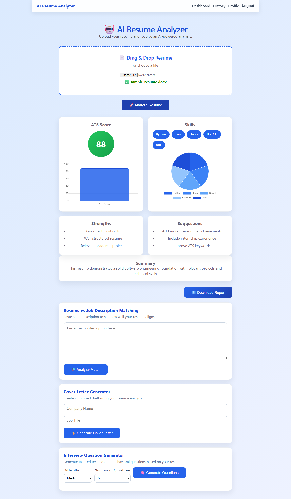
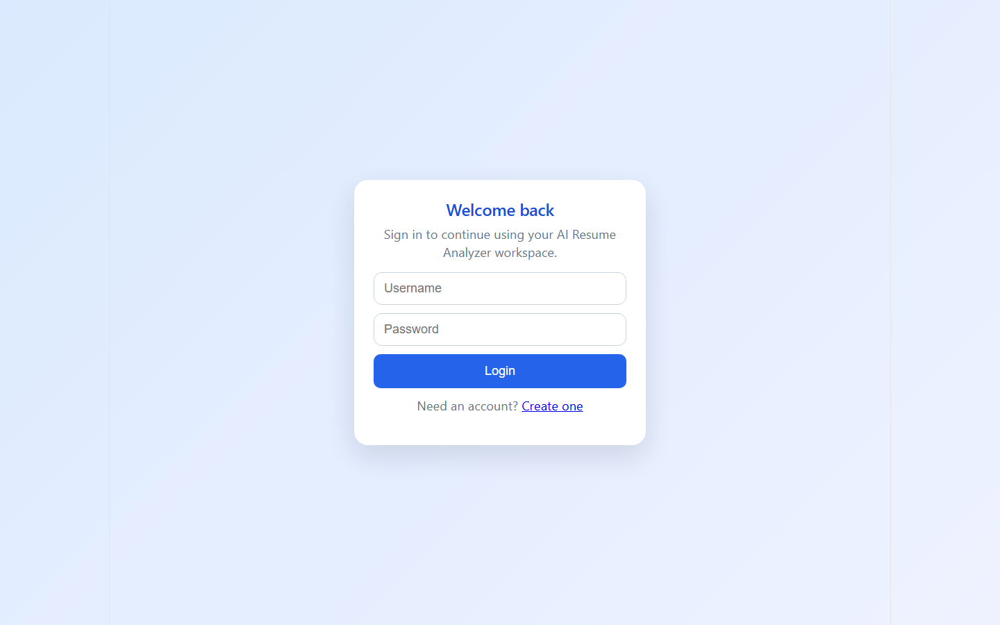
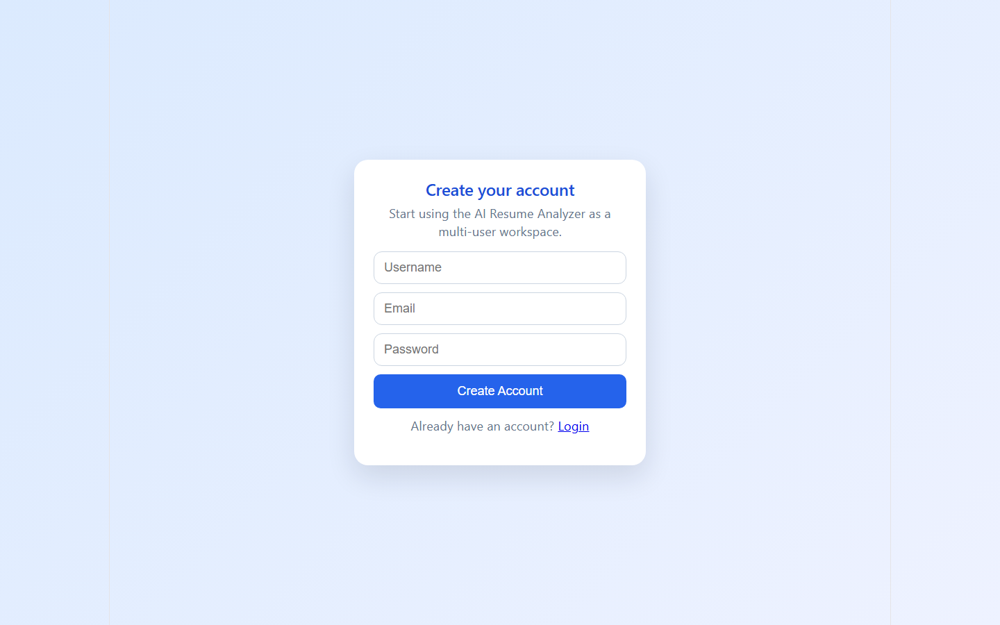
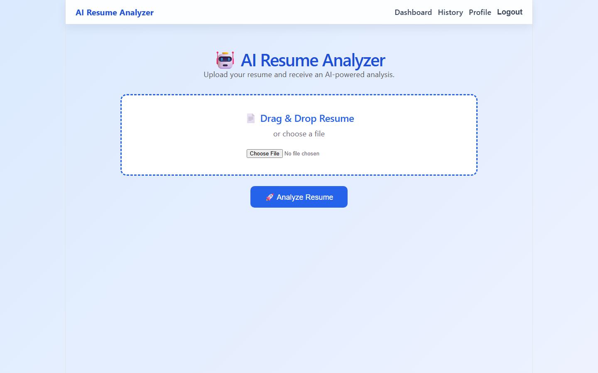
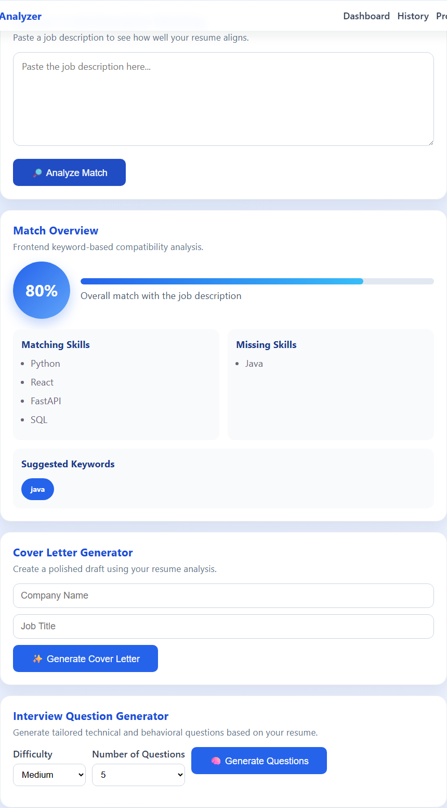
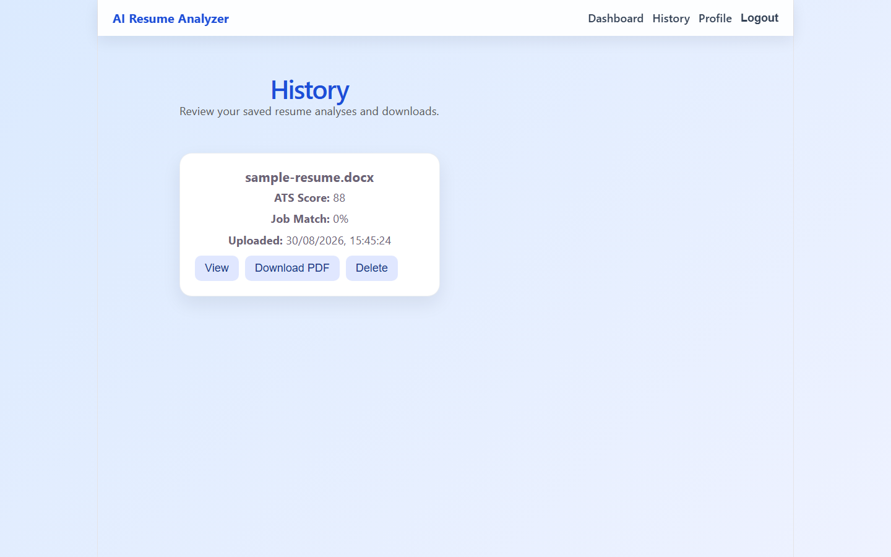
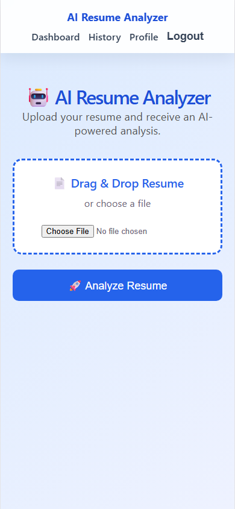
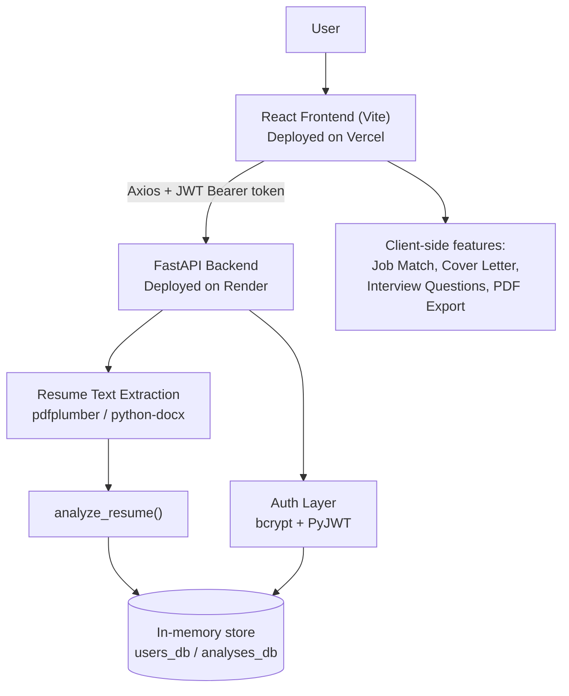

# AI Resume Analyzer

A full-stack web app where users upload a resume, get an instant ATS-style score with skill and improvement feedback, check how well it matches a job description, and export a cover letter, interview questions, and a PDF report — all behind a secure, multi-user login.

**Live app:** [ai-resume-analyzer-sailu1.vercel.app](https://ai-resume-analyzer-sailu1.vercel.app/)



## Overview

Tailoring a resume for every application and guessing whether it will survive an ATS filter is tedious. This project gives users a single place to do that: sign up, drop in a resume (PDF or DOCX), and immediately see an ATS score, extracted skills, strengths, and suggested improvements on a dashboard. From there, users can paste a job description to see a keyword-based match score, generate a draft cover letter and a set of interview questions from the analysis, download everything as a PDF report, and revisit past uploads from a history page.

The backend is a FastAPI service with real signup/login (hashed passwords + JWT sessions) and real resume text extraction from PDF/DOCX files. The result it returns today is a fixed demo analysis rather than a live call to an LLM — see [Notes on the Analysis Engine](#notes-on-the-analysis-engine) below for the honest breakdown of what's live versus scaffolded.

## Features

- **Account system** — signup/login with bcrypt-hashed passwords and JWT-based sessions; dashboard, history, and profile routes are all auth-protected
- **Resume upload** — drag-and-drop or file picker, accepts PDF and DOCX
- **Resume text extraction** — real parsing via `pdfplumber` (PDF) and `python-docx` (DOCX)
- **Resume analysis dashboard** — ATS score, extracted skills, strengths, and improvement suggestions, visualized with Chart.js (bar + pie charts)
- **Job description matching** — paste a job description and get a match percentage, matching/missing skills, and suggested keywords (computed client-side against the extracted skill list)
- **Cover letter generator** — produces a formatted draft cover letter from the resume analysis, copyable and downloadable as a PDF
- **Interview question generator** — generates technical and behavioral questions based on the analysis, with adjustable difficulty and count
- **PDF report export** — downloads the full analysis (score, skills, strengths, suggestions, job match) as a single PDF via jsPDF
- **Analysis history** — per-user list of past uploads with the option to delete an entry

## Notes on the Analysis Engine

To keep this README accurate: `backend/app/ai.py` currently returns a **fixed, hardcoded analysis** (same score, skills, strengths, and suggestions for every resume). The `google-genai` (Gemini) SDK is already a backend dependency and a `GEMINI_API_KEY` is wired up via environment variables, but `analyze_resume()` doesn't call it yet — that's the next real step for this project (tracked under [Future Improvements](#future-improvements)). The job-match, cover letter, and interview-question features are genuine, working features, but they run entirely client-side as rule-based/template logic, not LLM calls.

## Screenshots

| | |
|---|---|
| **Login**  | **Sign Up**  |
| **Resume Upload**  | **Job Description Match**  |
| **History**  | **Mobile View**  |

Full analysis dashboard (ATS score, skills, strengths, suggestions, summary): [docs/screenshots/analysis-results.png](docs/screenshots/analysis-results.png)

> Screenshots were captured from a local run of this exact codebase using a fictional sample resume — no real personal data is shown.

## Tech Stack

| Layer | Technology |
|---|---|
| Frontend | React 19, Vite, React Router v7 |
| HTTP Client | Axios |
| Charts | Chart.js (via react-chartjs-2) |
| PDF Export | jsPDF |
| Backend | FastAPI (Python) |
| Authentication | JWT (PyJWT) + bcrypt password hashing |
| Resume Parsing | pdfplumber (PDF), python-docx (DOCX) |
| AI SDK (integrated, not yet wired to analysis) | Google Gemini (`google-genai`) |
| Data Storage | In-memory Python data structures — no persistent database yet |
| Deployment | Vercel (frontend), Render (backend) |
| Linting | Oxlint |

## System Architecture



## Project Structure

```
AI-Resume-Analyzer/
├── backend/
│   ├── app/
│   │   ├── main.py        # FastAPI app, routes, auth, CORS
│   │   ├── ai.py           # Resume analysis (currently a fixed demo response)
│   │   ├── parser.py       # PDF/DOCX text extraction
│   │   └── models.py       # User/Analysis dataclasses + in-memory stores
│   ├── uploads/            # Uploaded resumes at runtime (gitignored)
│   └── requirements.txt
├── frontend/
│   ├── src/
│   │   ├── App.jsx                  # Routes, upload flow, dashboard
│   │   ├── pages/                   # Login, Signup, History
│   │   ├── components/              # JobDescription, MatchResults,
│   │   │                            # CoverLetter, InterviewQuestions
│   │   ├── components/charts/       # ATSChart, SkillsChart (Chart.js)
│   │   └── utils/pdfGenerator.js    # Client-side PDF report export
│   └── package.json
└── docs/screenshots/       # README screenshots
```

## How It Works

1. A new user signs up (or logs in) — the backend hashes the password with bcrypt and issues a JWT on success.
2. From the dashboard, the user drags in or selects a resume (PDF/DOCX) and clicks **Analyze Resume**.
3. The file is sent to `POST /upload` with the JWT as a Bearer token; the backend saves it, extracts its text, and runs it through the analysis engine.
4. The dashboard renders the ATS score, skills, strengths, and suggestions, with chart visualizations.
5. The user can optionally paste a job description to get a client-side match score against the extracted skills, generate a cover letter or interview questions from the analysis, and download a full PDF report.
6. Every analysis is saved to the user's history, viewable (and deletable) on the History page.

## API

Base URL (production): the backend is deployed on Render (see [Deployment](#deployment)).

| Method | Route | Auth | Request Body | Response | Purpose |
|---|---|---|---|---|---|
| GET | `/` | No | — | `{ "message": "AI Resume Analyzer API is running" }` | Health check |
| POST | `/signup` | No | `{ username, email, password }` | `{ "message": "User created successfully" }` | Create a new user |
| POST | `/login` | No | `{ username, password }` | `{ access_token, token_type, user }` | Authenticate and receive a JWT |
| POST | `/upload` | Yes (Bearer) | `multipart/form-data` with `file` (`.pdf`/`.docx`) | `{ filename, status, analysis }` | Upload and analyze a resume |
| GET | `/history` | Yes (Bearer) | — | `{ analyses: [...] }` | List the current user's saved analyses |
| DELETE | `/history/{analysis_id}` | Yes (Bearer) | — | `{ "message": "Deleted successfully" }` | Delete one saved analysis |

Auth-protected routes expect `Authorization: Bearer <access_token>`.

## Local Setup

### Prerequisites
- Node.js (for the frontend)
- Python 3.12+ (for the backend)

### Backend

```bash
git clone https://github.com/Chittalasailu/AI-Resume-Analyzer.git
cd AI-Resume-Analyzer/backend

python -m venv venv
venv\Scripts\activate        # Windows
# source venv/bin/activate   # macOS/Linux

pip install -r requirements.txt

# create backend/.env — see Environment Variables below
uvicorn app.main:app --reload --port 8000
```

### Frontend

```bash
cd AI-Resume-Analyzer/frontend
npm install
npm run dev
```

> **Note:** the frontend currently hardcodes the API base URL to the deployed Render backend inside `App.jsx`, `Login.jsx`, `Signup.jsx`, and `History.jsx`, rather than reading it from an environment variable. To run the frontend against your local backend, temporarily point those URLs at `http://localhost:8000` (and add `http://localhost:5173` — or whichever port Vite picks — to the CORS `allow_origins` list in `backend/app/main.py`).

## Environment Variables

Backend configuration lives in `backend/.env` (gitignored). See [backend/.env.example](backend/.env.example):

| Variable | Purpose |
|---|---|
| `GEMINI_API_KEY` | Google Gemini API key (SDK is wired up; not yet called by the analysis engine) |
| `JWT_SECRET` | Secret used to sign JWTs. Falls back to an insecure default if unset — always set this explicitly outside of local dev |

The frontend does not currently use environment variables (see the note above).

## Deployment

- **Frontend:** [Vercel](https://vercel.com) — static build of the Vite/React app
- **Backend:** [Render](https://render.com) — FastAPI service run with Uvicorn

**Live app:** [ai-resume-analyzer-sailu1.vercel.app](https://ai-resume-analyzer-sailu1.vercel.app/)

## Testing

No automated test suite is currently included in this project.

## Future Improvements

- Wire `analyze_resume()` up to the already-configured Gemini API so analysis is generated live from the actual resume text, instead of returning a fixed demo response
- Replace in-memory storage (`users_db`, `analyses_db`) with a persistent database (e.g., PostgreSQL) so accounts and history survive a server restart
- Move the frontend's hardcoded API base URL into an environment variable (e.g., `VITE_API_URL`)
- Move job-description matching server-side with real NLP-based similarity instead of client-side keyword overlap
- Add automated backend and frontend tests
- Require `JWT_SECRET` to be set explicitly in production rather than falling back to a default value

## License

No license file is currently included in this repository — all rights reserved by the author unless a license is added.

## Author

**Sailu Chittala**
GitHub: [github.com/Chittalasailu](https://github.com/Chittalasailu)
